# Readme

This is a very simple autoencoder built with Tensorflow for MNIST digits.

I have tested with Google Colab, it should work anywhere.

# Training
Trained on the first 60k samples, then ran samples 60k->66k through the autoencoder. All the code is in `autoencoder.py`

# Results

### Evaluation Samples on top, encoded/decoded below (~220 epochs)

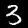 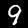  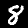    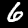  

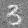 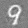 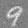 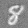 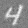 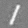 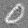 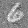 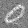 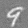
